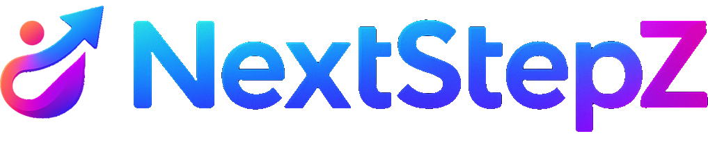

  

<h1 align="center">NextStepZ</h1>

  <strong>Your First Step to the Future</strong>

  <em>A Full-Stack Academic Web Project</em>

---

## 📖 Overview
**NextStepZ** is a full-stack web application developed as a  
**Second-Year Academic Project** at the  
**Vietnam–Korea University of Information Technology (VKU)**.

The project demonstrates the practical application of modern web technologies,
software engineering principles, and clean architectural design to build a
secure, scalable, and maintainable platform.

---

## 🎯 Project Goals
- Apply theoretical knowledge to a real-world full-stack application
- Build a modern, responsive, and user-friendly interface
- Design a secure and scalable backend architecture
- Implement authentication and authorization using best practices
- Practice professional development workflows and teamwork standards

---

## 👤 Author
| | |
|--|--|
| **Name** | Nguyễn Ngọc Thái |
| **Major** | Information Technology (Engineer) |
| **University** | Vietnam–Korea University of Information Technology (VKU) |
| **Academic Level** | Second-Year Student |

---

## 🧰 Technology Stack

### 🌐 Frontend
- **Framework:** Next.js 15+  
- **Library:** React  
- **Language:** TypeScript  
- **Styling:** CSS Modules + PostCSS  
- **UI Library:** shadcn/ui  
- **State Management:** React Context API  
- **API Communication:** Fetch API  
- **Testing:** Jest  
- **Code Quality:** ESLint  

### ⚙️ Backend
- **Framework:** NestJS  
- **Database:** PostgreSQL  
- **ORM:** Prisma  
- **Authentication:** JWT + bcrypt  

### 🐳 Infrastructure
- **Containerization:** Docker  

---

## ✨ Key Features
- Modern UI built with Next.js, React, and shadcn/ui
- Type-safe frontend development using TypeScript
- Secure authentication with JWT and password hashing using bcrypt
- Clean and modular backend architecture powered by NestJS
- Database schema management and data access using Prisma ORM
- PostgreSQL for reliable and scalable data persistence
- Dockerized environment for consistent development and deployment
- Code quality enforcement with ESLint
- Unit testing setup with Jest

---

## 🧪 Development Practices
- Modular project structure
- Clear separation of concerns
- Environment-based configuration
- Consistent code style and linting
- Version control with meaningful commit history

---

## ⚠️ Academic Integrity Statement
This repository is published **exclusively for academic evaluation and learning purposes**.

🚫 **Strictly prohibited actions:**
- Copying or reusing this project for coursework or academic submissions
- Submitting this project as original work by any individual or group
- Redistributing or modifying the source code without explicit permission

Any violation may be handled in accordance with the academic regulations of  
**Vietnam–Korea University of Information Technology (VKU)**.

---

## 📄 License
This project is protected under an **All Rights Reserved License**.

Please refer to the [LICENSE](./LICENSE) file for detailed terms and usage restrictions.

---

## 🚀 Vision
> **NextStepZ is designed to help users take their first confident step toward the future through technology.**
